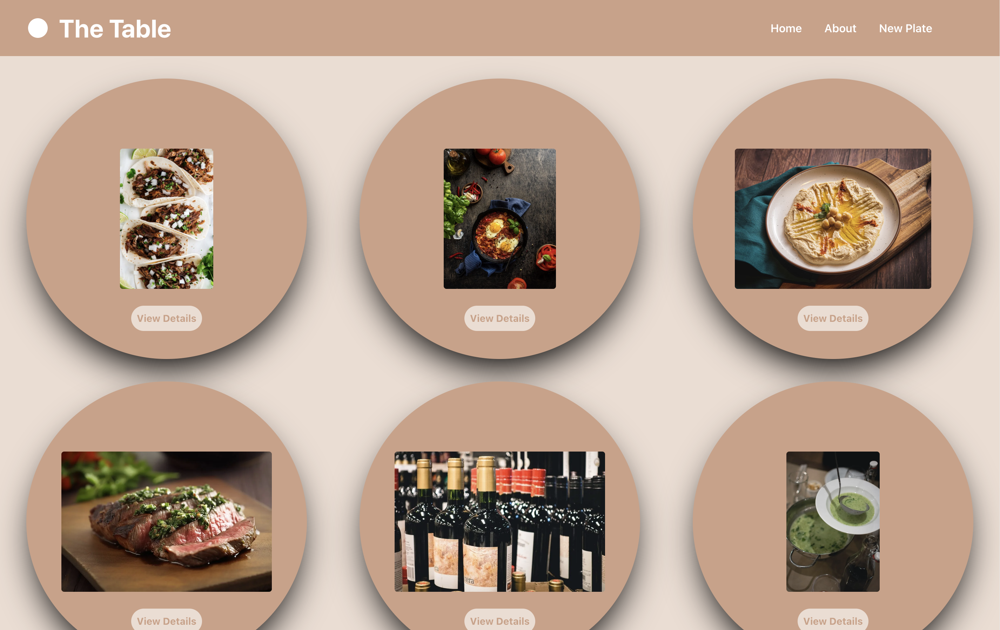

# Welcome to The Table Fontend Repo 

[Netlify Link](https://thetable-app.netlify.app/)

## Table of Contents
- [Technologies used](#technologies-used)
- [Frontend Dependencies](#frontend-dependencies)
- [Github](#github)
- [Frontend Frame work](#frontend-frame-work)
- [Frontend Dependencies](#frontend-dependencies)
- [Installation](#installation)
- [License](#license)

##  Technologies Used
The Table Potluck App leverages the following technologies and frameworks:

## [Github](https://github.com/)
### Backend Repo:
[The Table Backend Repo](https://github.com/joshuanelsondev/table-backend-project)

## Frontend Frame work
- React.js
- React Router
- Axios
- Tailwind CSS
- Canva (for creating beautiful designs)

### Frontend Dependencies: 
- react: ^17.0.2
- react-dom: ^17.0.2
- react-router-dom: ^5.3.0
react-dom
- axios: ^0.21.1
- tailwindcss: ^2.2.7

# Installation
 - npm install react react-dom 
 - npm i react-router-dom axios  
 - tailwindcss @tailwindcss/postcss7-compat postcss autoprefixer cross-env --save

 ## cd client/the table frontend repo  
 - npm install

 ## Set up the environment variables:

- Create a .env file in the project root.
- Define the required environment variables, such as the database connection string, API keys, etc.
- gitnore which allows you to specify files or directories that should be excluded from version control. 

The Table frontend will run on [The Table](http://localhost:3000)

# License
This project is licensed under [Pursuit](https://www.pursuit.org/)
